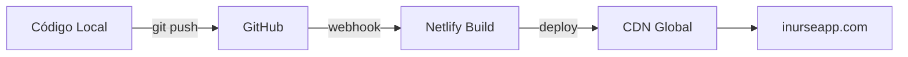

# 🚀 Guia de Deploy - iNurseApp Frontend

Este documento descreve o processo de deploy do frontend do iNurseApp.

## 📦 Deploy Atual

### Plataforma
- **Netlify** (https://netlify.com)
- **Domínio**: https://inurseapp.com
- **Status**: ✅ Online

### Configuração Netlify

```toml
# Ver netlify.toml para configuração completa
Build Command: (vazio - site estático)
Publish Directory: . (raiz)
```

## 🔄 Deploy Automático via GitHub

### Passo 1: Criar Repositório no GitHub

```bash
# Via GitHub CLI (se tiver instalado)
gh repo create inurseapp-frontend --public --description "Frontend do iNurseApp"

# Ou via web: https://github.com/new
```

### Passo 2: Push do Código

```bash
# Inicializar Git (se ainda não foi feito)
git init
git add .
git commit -m "chore: initial commit with complete frontend"
git branch -M main

# Adicionar remote
git remote add origin https://github.com/edumelogeneses/inurseapp-frontend.git

# Push
git push -u origin main
```

### Passo 3: Conectar Netlify ao GitHub

1. Acesse: https://app.netlify.com
2. Vá em **Site settings**
3. **Build & deploy** → **Link repository**
4. Autorize GitHub
5. Selecione: `edumelogeneses/inurseapp-frontend`
6. Configure:
   - **Branch**: `main`
   - **Build command**: (deixe vazio)
   - **Publish directory**: `.`
7. Click **Deploy**

### Resultado

✅ Cada `git push` dispara deploy automático  
✅ Preview automático para Pull Requests  
✅ Rollback com 1 click  
✅ Notificações de build  

## 🌍 Deploy Manual (Fallback)

Se precisar fazer deploy manual:

```bash
# Via Netlify CLI
npm install -g netlify-cli
netlify login
netlify deploy --prod

# Ou via drag & drop:
# 1. Acesse https://app.netlify.com/drop
# 2. Arraste a pasta do projeto
```

## 🔧 Configurações de Domínio

### DNS Records (Namecheap)

```
Type: CNAME
Host: @
Value: inurseapp.netlify.app

Type: CNAME  
Host: www
Value: inurseapp.netlify.app
```

### Netlify Domain Settings

1. **Domain management** → **Add domain**
2. Adicione: `inurseapp.com`
3. Verifique DNS
4. Aguarde propagação (até 48h)
5. SSL automático será provisionado

## 📊 Monitoramento

### Google Analytics
- **ID**: G-5F3XF8G5KN
- **Dashboard**: https://analytics.google.com

### Netlify Analytics
- Acesse: Site settings → Analytics
- Veja: Page views, bandwidth, forms

## 🐛 Troubleshooting

### Deploy Falha

```bash
# Verificar logs
netlify logs

# Clear cache e rebuild
netlify build --clear-cache
```

### Domínio não Resolve

```bash
# Verificar DNS
nslookup inurseapp.com
dig inurseapp.com

# Verificar propagação
https://dnschecker.org
```

### CORS Errors

Verifique se o backend tem os domínios corretos:

```python
# backend/app/main.py
ALLOWED_ORIGINS = [
    "https://inurseapp.com",
    "https://www.inurseapp.com",
]
```

## 🔐 Variáveis de Ambiente

O frontend atualmente não usa variáveis de ambiente (API URL é hardcoded em `js/api.js`).

Se adicionar no futuro:

1. Netlify → Site settings → Environment variables
2. Adicionar variáveis
3. Rebuild o site

## 📈 Performance

### Otimizações Aplicadas

- ✅ Minificação CSS/JS via Netlify
- ✅ CDN global
- ✅ HTTP/2 e HTTP/3
- ✅ Brotli compression
- ✅ Cache headers otimizados
- ✅ Preconnect para APIs críticas

### Lighthouse Score Esperado

- **Performance**: 95+
- **Accessibility**: 95+
- **Best Practices**: 95+
- **SEO**: 95+

## 🔄 Workflow de Deploy



## 📝 Checklist Pré-Deploy

- [ ] Testar todas as páginas localmente
- [ ] Verificar links internos
- [ ] Validar formulários
- [ ] Testar integração com API
- [ ] Verificar responsividade
- [ ] Rodar Lighthouse audit
- [ ] Atualizar CHANGELOG.md
- [ ] Criar tag de versão
- [ ] Push para main

## 🎯 Próximos Passos

1. Conectar repositório ao Netlify
2. Configurar notificações de deploy
3. Adicionar status badge no README
4. Configurar deploy previews
5. Habilitar split testing (se necessário)

---

**Última atualização**: 2026-02-11  
**Responsável**: Eduardo Elias de Melo
